# 🟡🤝Meli REP MXCD09 - Repositorio de Proyectos Personales para MercadoLibre  

Este repositorio funciona como archivo de los proyectos personales que desarrollé durante mi contrato como **REP (Representante de Envíos)** en **MercadoLibre**.

Todos los proyectos mostrados —de los cuales conservo el código fuente, creado completamente por mí— fueron diseñados con el objetivo de **optimizar procesos internos** 📦.

Si bien no llegaron a implementarse públicamente debido a la finalización de mi contrato, **dos de estos softwares fueron utilizados de manera interna**, contribuyendo a la eficiencia operativa del área de envíos.

Las imágenes adjuntas muestran ejemplos visuales de los desarrollos realizados.

🧠 *Me hubiera gustado desempeñarme como programador dentro de la compañía y llevar a la realidad la optimización de procesos que estos proyectos que propuse como prototipo.*

> **Mi contacto provisional (correo de contacto de mi startup)** : contact@instantcodify.com

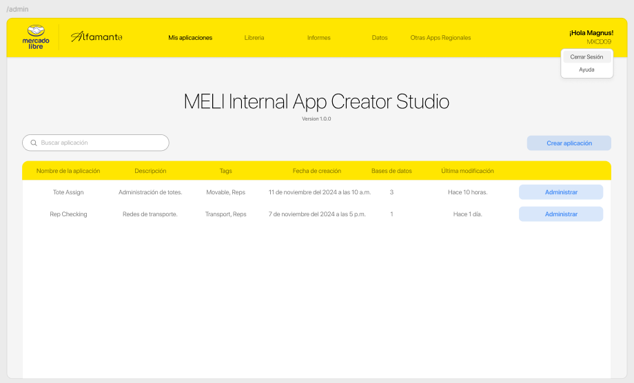
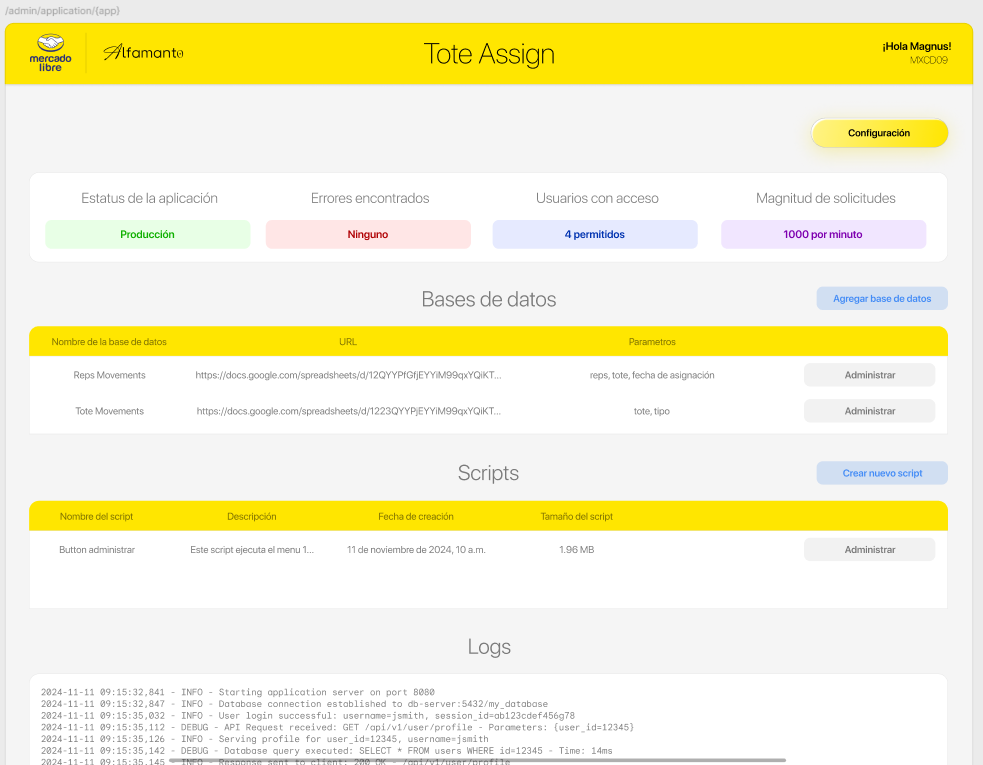
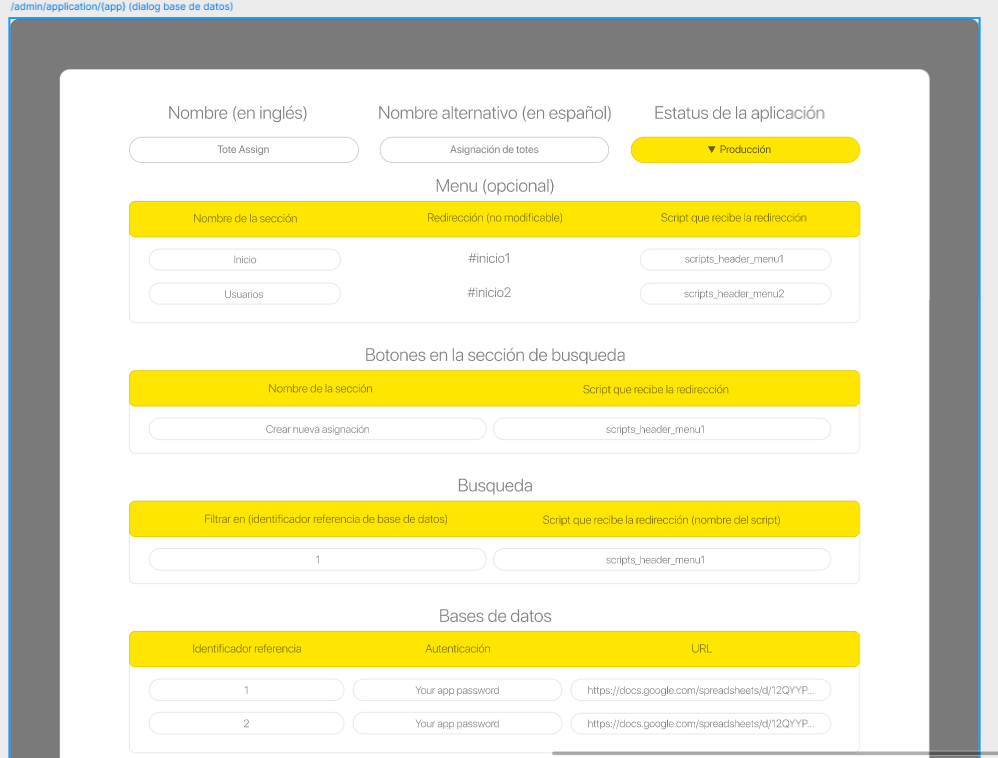
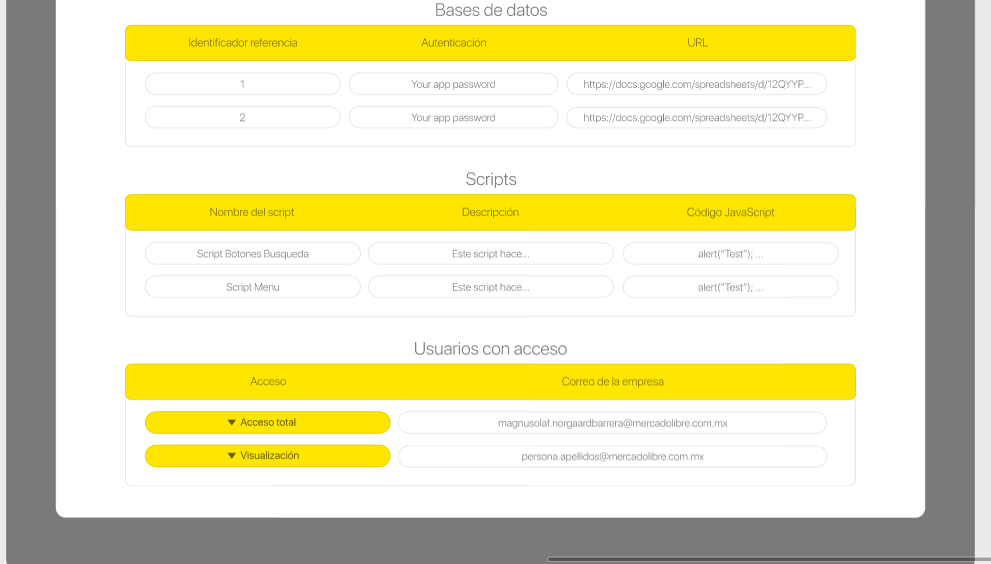
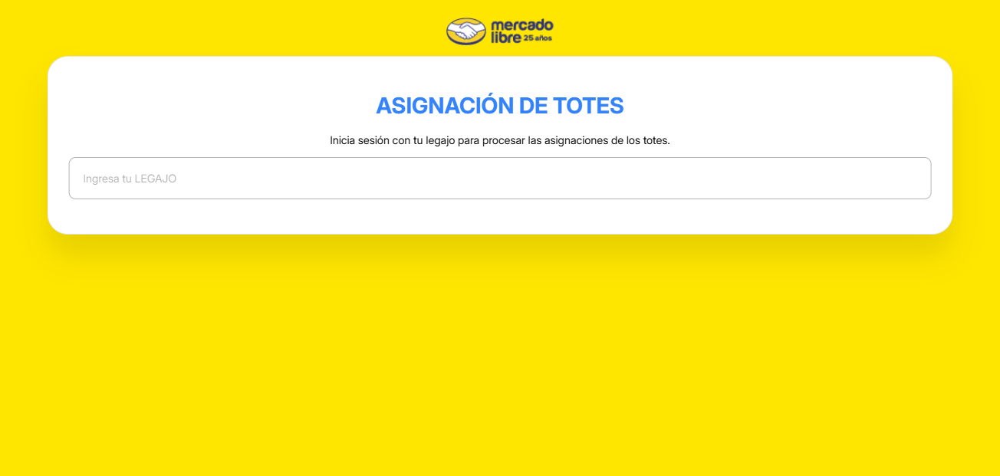
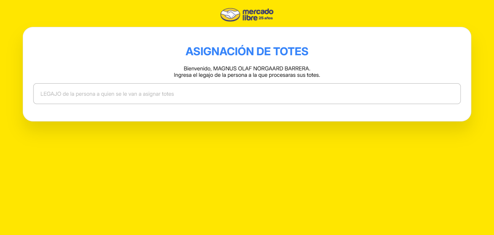
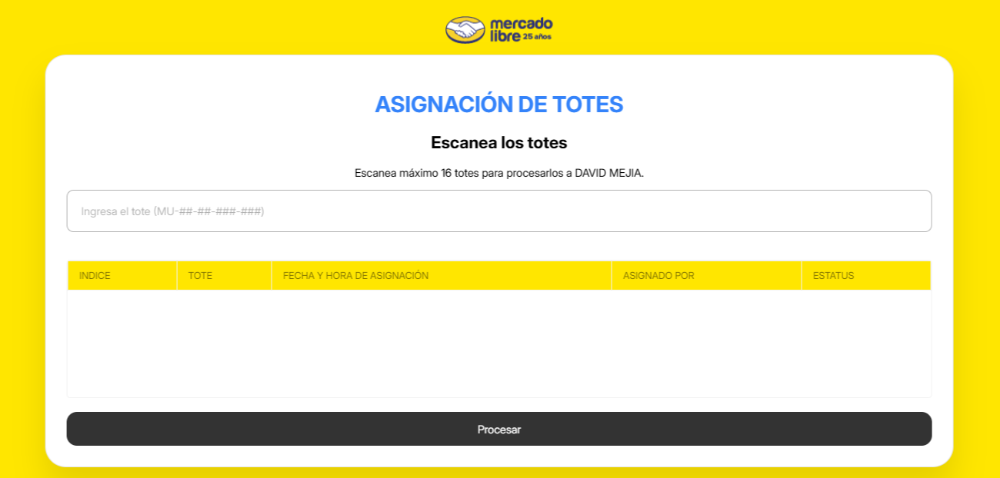
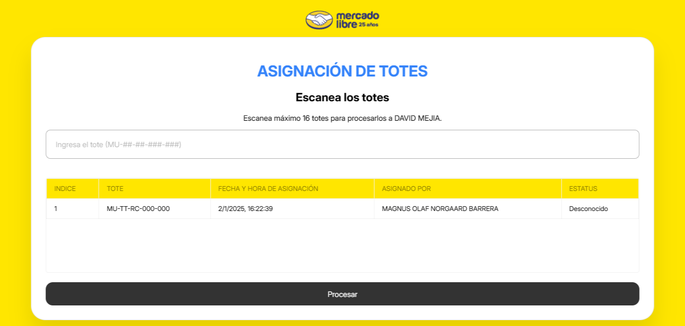

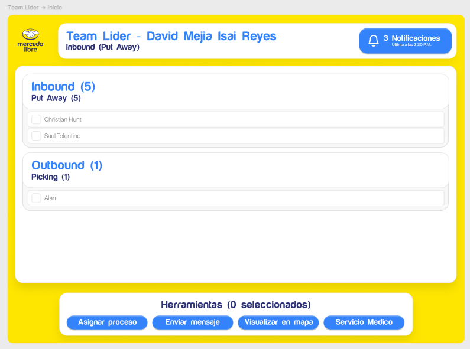
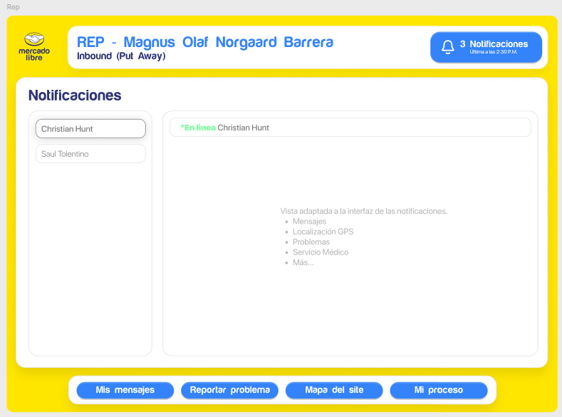
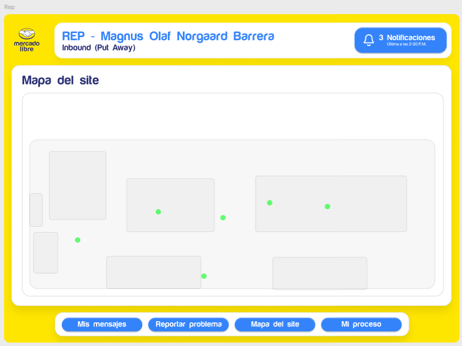
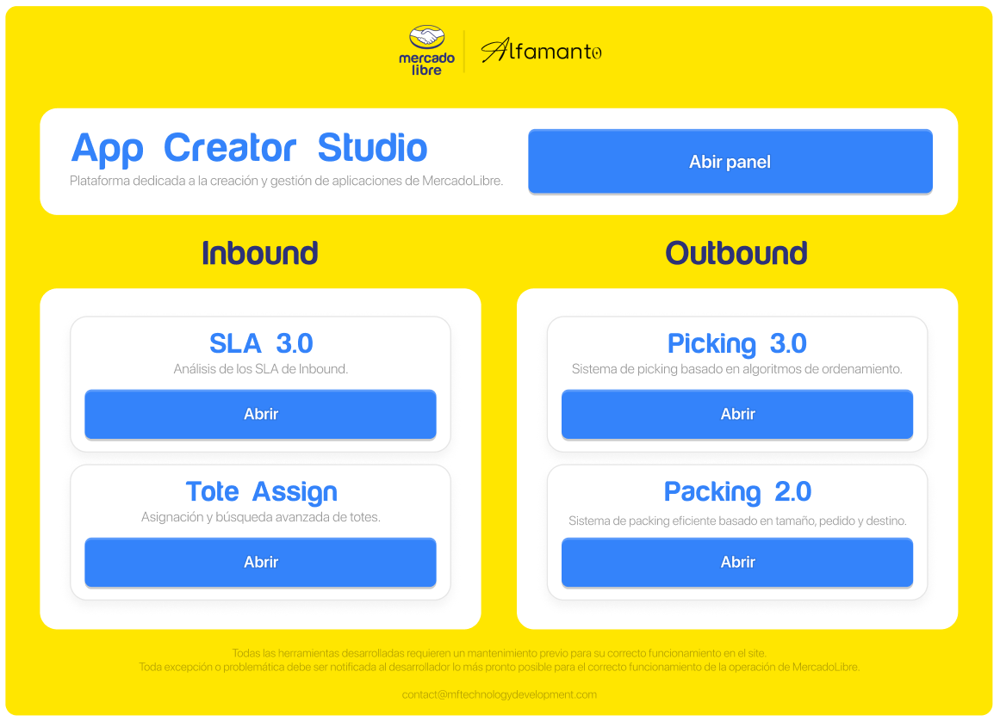
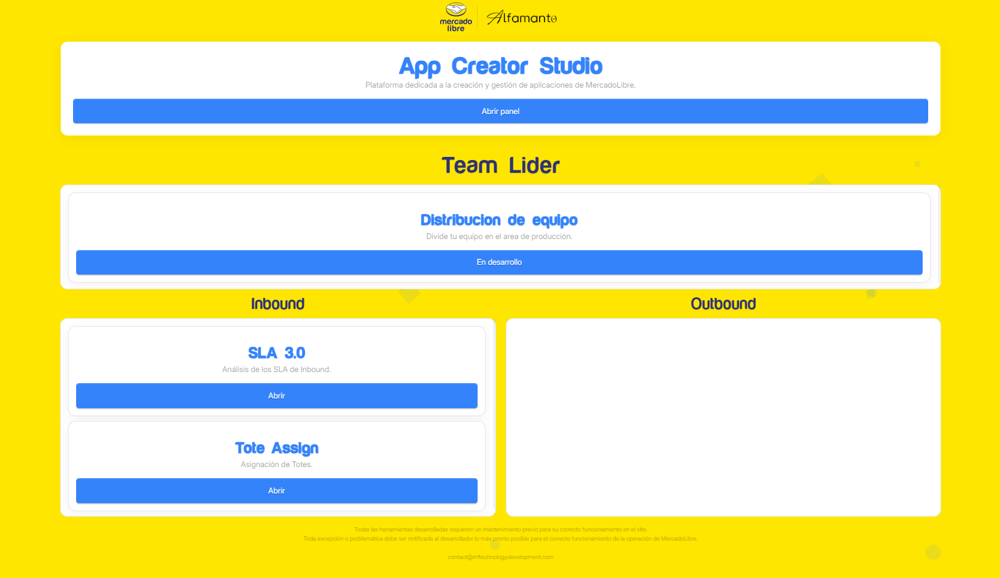
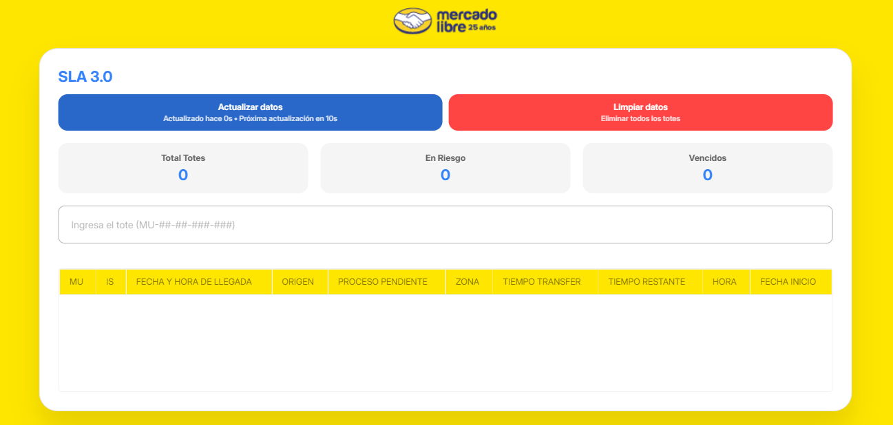
