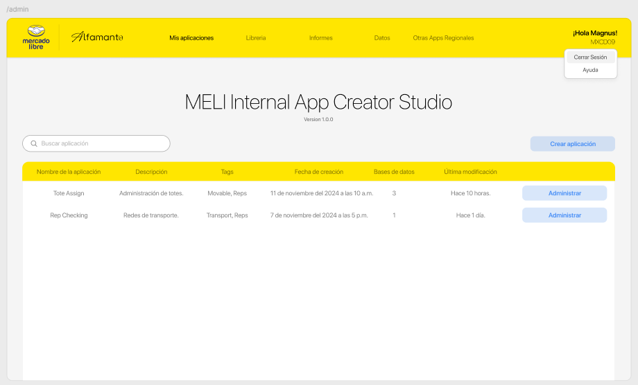
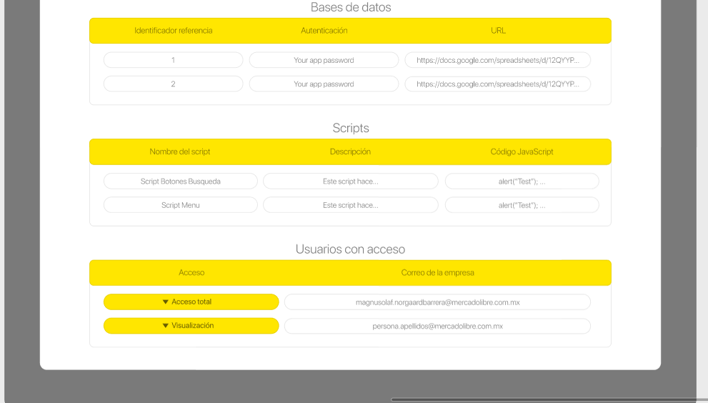
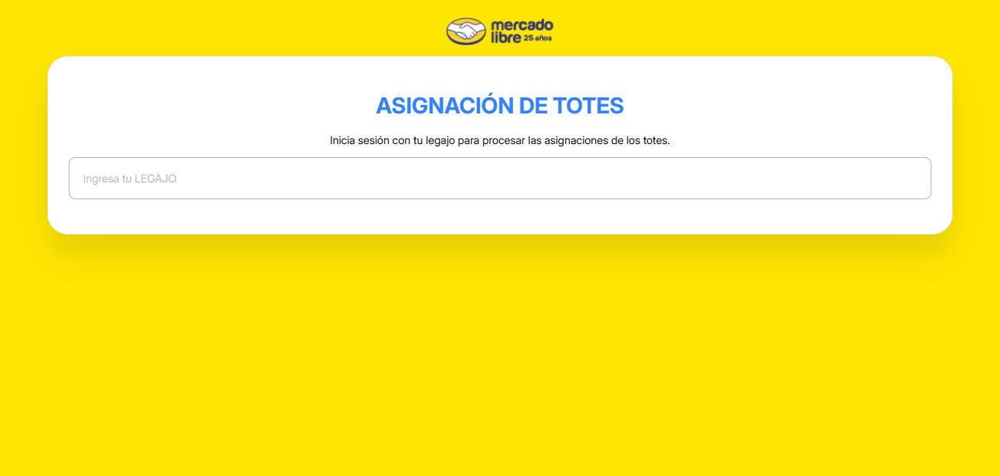
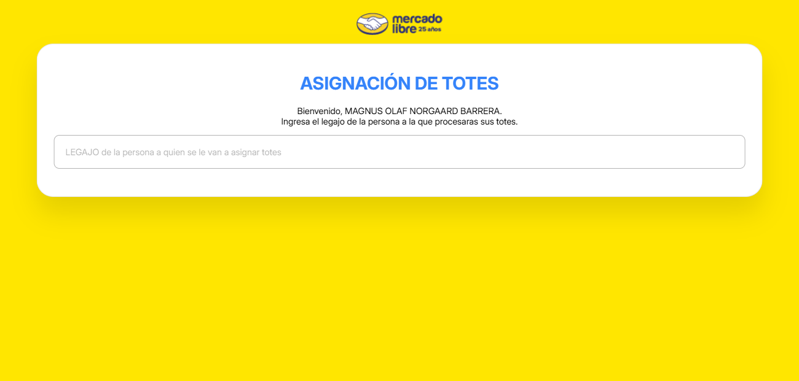
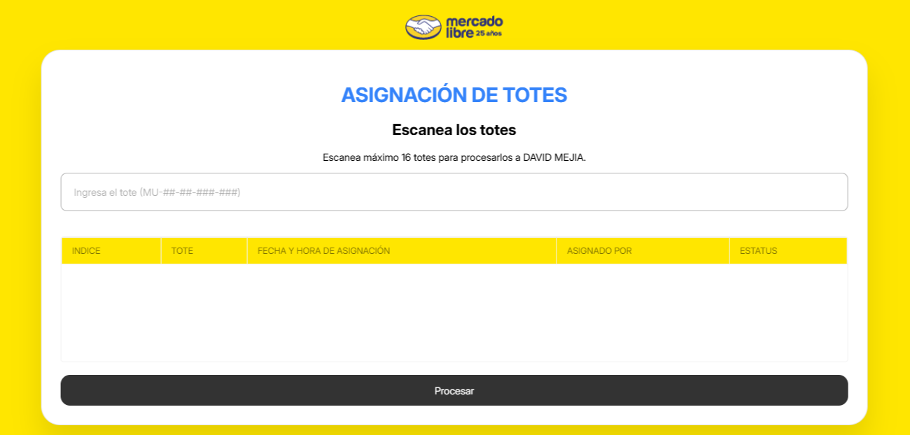
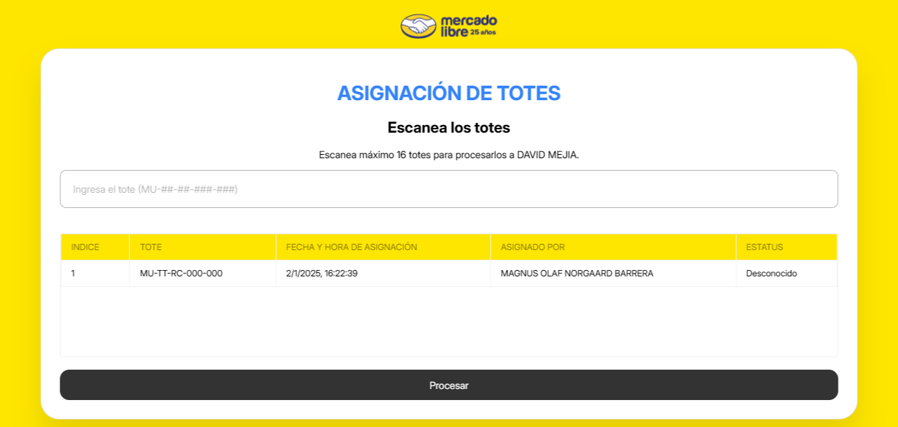
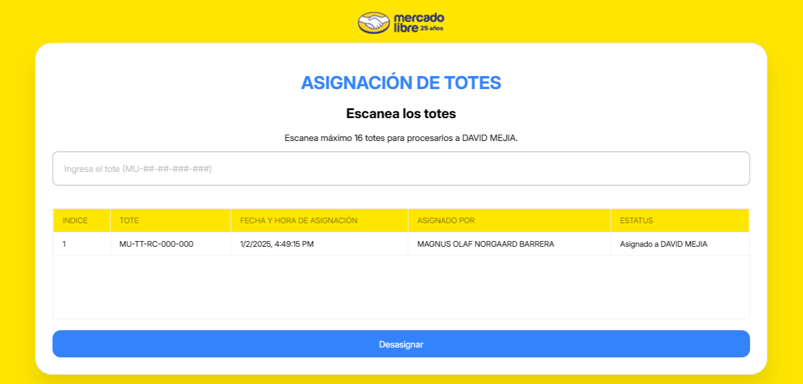
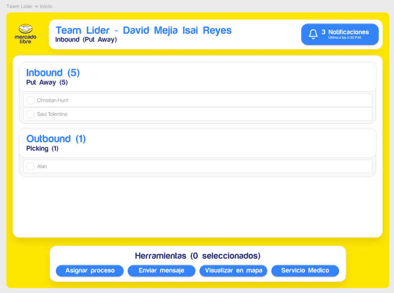
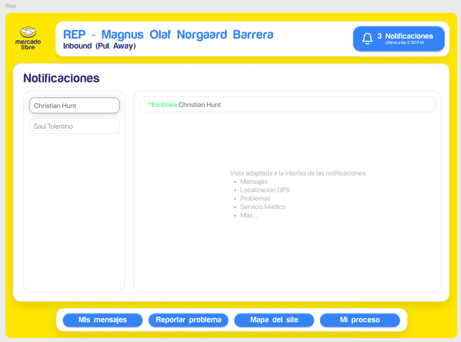
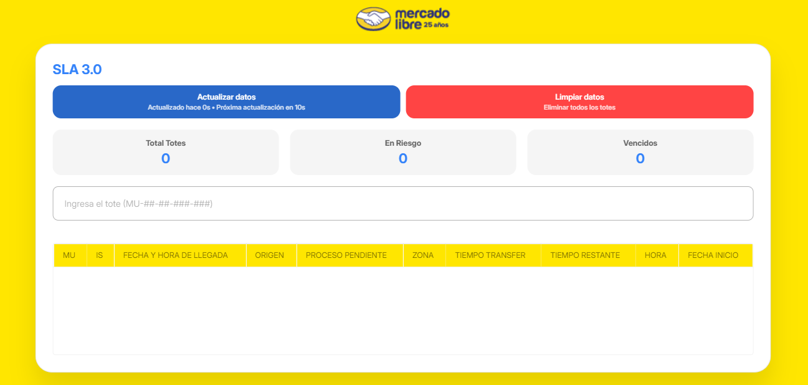

# 🟡🤝Meli REP MXCD09 - Repositorio de Proyectos Personales para MercadoLibre  

Este repositorio funciona como archivo de los proyectos personales que desarrollé durante mi contrato como **REP (Representante de Envíos)** en **MercadoLibre**.
Todos los proyectos mostrados —de los cuales conservo el código fuente, creado completamente por mí— fueron diseñados con el objetivo de **optimizar procesos internos** 📦.
Si bien no llegaron a implementarse públicamente debido a la finalización de mi contrato, **dos de estos softwares fueron utilizados de manera interna**, contribuyendo a la eficiencia operativa del área de envíos.
Las im√°genes adjuntas muestran ejemplos visuales de los desarrollos realizados.

**Mi contacto provisional (correo de contacto de mi startup)** : contact@instantcodify.com

